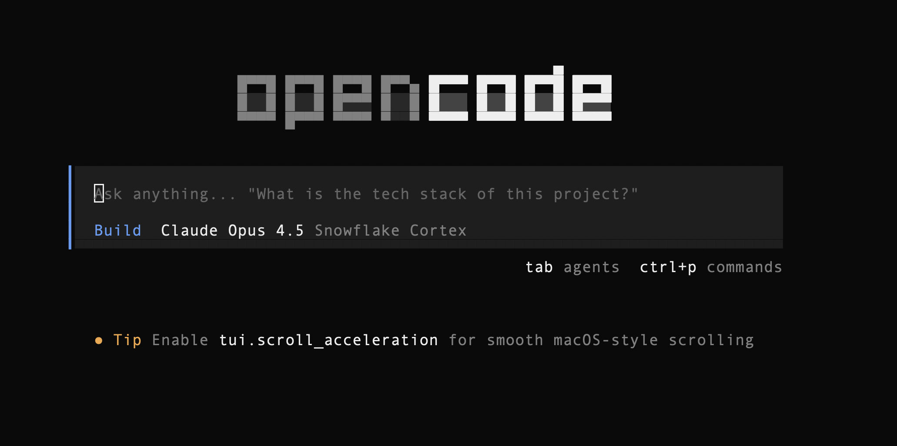

<p align="center">
  <a href="https://opencode.ai">
    <picture>
      <source srcset="packages/console/app/src/asset/logo-ornate-dark.svg" media="(prefers-color-scheme: dark)">
      <source srcset="packages/console/app/src/asset/logo-ornate-light.svg" media="(prefers-color-scheme: light)">
      
    </picture>
  </a>
</p>
<p align="center"><strong>Snowflake Cortex Edition</strong></p>
<p align="center">Community fork for Snowflake Cortex compatibility</p>
<p align="center">The open source AI coding agent.</p>
<p align="center">
   
  </a>
</p>
<p align="center"><em>Not an official Snowflake or OpenCode project.</em></p>
<p align="center">This proof-of-technology fork was assembled by Kevin Keller. Snowflake and OpenCode logos are copyrighted by their respective owners, and this project is not endorsed by either.</p>
<p align="center">PR submitted to upstream OpenCode: https://github.com/anomalyco/opencode/pull/11455</p>
<p align="center">
  <a href="https://opencode.ai/discord"></a>
  <a href="https://www.npmjs.com/package/opencode-ai"></a>
  <a href="https://github.com/anomalyco/opencode/actions/workflows/publish.yml"></a>
</p>

[](https://github.com/sfc-gh-kkeller/Opencode-Snowflake-Cortex-Edition)

---

### Installation

```bash
# Install prebuilt binary (recommended)
curl -fsSL https://github.com/sfc-gh-kkeller/Opencode-Snowflake-Cortex-Edition/releases/latest/download/install.sh | bash

# Or build from source (installs bun if needed, clones, builds, installs)
curl -fsSL https://github.com/sfc-gh-kkeller/Opencode-Snowflake-Cortex-Edition/releases/latest/download/install_source.sh | bash
```

> [!TIP]
> Remove versions older than 0.1.x before installing.

### Snowflake Cortex Edition

This edition adds Snowflake Cortex compatibility and is intended to make OpenCode work reliably with Cortex's OpenAI-compatible API.
It is a community-maintained fork by Kevin Keller and is not affiliated with the OpenCode team.

Based on upstream OpenCode v1.2.5.

How it differs:

- **Snowflake error handling**: Treats Cortex "conversation complete" errors as a normal stop.
- **Request compatibility**: Maps `max_tokens` → `max_completion_tokens` when using Cortex.
- **Provider options**: Ensures the `snowflakeCortex` flag is applied consistently to models at runtime.

Quick start:

Option 1 — Download a prebuilt binary (recommended):

- Releases: https://github.com/sfc-gh-kkeller/Opencode-Snowflake-Cortex-Edition/releases
- Command: `opencode_cortex`

Option 2 — Build from source:

```bash
git clone https://github.com/sfc-gh-kkeller/Opencode-Snowflake-Cortex-Edition.git
cd Opencode-Snowflake-Cortex-Edition
bun install
bun dev
```

Configure Snowflake Cortex:

This edition still supports the standard `opencode.json`/`opencode.jsonc` format.
You can use either `opencode.json` or `opencode_cortex.json` — both are compatible.
If both exist, `opencode_cortex.json` takes precedence.

Use the onboarding wizard (recommended):

```bash
opencode_cortex cortex-init
```

Or create `opencode_cortex.json` in your project (or `~/.config/opencode/opencode_cortex.jsonc` for user-wide config):

```jsonc
{
  "$schema": "https://opencode.ai/config.json",
  "provider": {
    "snowflake-cortex": {
      "npm": "@ai-sdk/openai-compatible",
      "name": "Snowflake Cortex",
      "options": {
        "baseURL": "https://<account>.snowflakecomputing.com/api/v2/cortex/v1",
        "headers": {
          "X-Snowflake-Authorization-Token-Type": "PROGRAMMATIC_ACCESS_TOKEN"
        },
        "snowflakeCortex": true
      },
      "models": {
        "claude-opus-4-6": {
          "name": "Claude Opus 4.6",
          "tool_call": true,
          "attachment": true,
          "limit": { "context": 200000, "output": 16384 }
        },
        "claude-opus-4-5": {
          "name": "Claude Opus 4.5",
          "tool_call": true,
          "attachment": true,
          "limit": { "context": 200000, "output": 8192 }
        }
      }
    }
  },
  "model": "snowflake-cortex/claude-opus-4-5"
}
```

### Snowflake Cortex: Quick How-To

1) Install the Snowflake edition:

```bash
curl -fsSL https://github.com/sfc-gh-kkeller/Opencode-Snowflake-Cortex-Edition/releases/latest/download/install.sh | bash
```

2) Run the onboarding wizard (imports Snowflake CLI config if present):

```bash
opencode_cortex cortex-init
```

3) Set your PAT (if you chose env var in the wizard):

```bash
export SNOWFLAKE_PAT="your_pat_here"
```

4) Start OpenCode Cortex:

```bash
opencode_cortex
```

5) Verify/adjust config if needed:
- Project: `./opencode_cortex.json` or `./opencode_cortex.jsonc`
- Global: `~/.config/opencode/opencode_cortex.jsonc`

Guides:

- [PATCHING.md](./PATCHING.md) — build + patch existing installs

#### Installation Directory

The install script respects the following priority order for the installation path:

1. `$OPENCODE_INSTALL_DIR` - Custom installation directory
2. `$XDG_BIN_DIR` - XDG Base Directory Specification compliant path
3. `$HOME/bin` - Standard user binary directory (if it exists or can be created)
4. `$HOME/.opencode/bin` - Default fallback

```bash
# Examples
OPENCODE_INSTALL_DIR=/usr/local/bin 
XDG_BIN_DIR=$HOME/.local/bin 
```

### Agents

OpenCode includes two built-in agents you can switch between with the `Tab` key.

- **build** - Default, full-access agent for development work
- **plan** - Read-only agent for analysis and code exploration
  - Denies file edits by default
  - Asks permission before running bash commands
  - Ideal for exploring unfamiliar codebases or planning changes

Also included is a **general** subagent for complex searches and multistep tasks.
This is used internally and can be invoked using `@general` in messages.

Learn more about [agents](https://opencode.ai/docs/agents).

### Documentation

For more info on how to configure OpenCode, [**head over to our docs**](https://opencode.ai/docs).

### Contributing

If you're interested in contributing to OpenCode Cortex edition, just create a PR 

### FAQ

#### How is this different from Claude Code?

It's very similar to Claude Code in terms of capability. Here are the key differences:

- 100% open source
- Not coupled to any provider. Although we recommend the models we provide through [OpenCode Zen](https://opencode.ai/zen), OpenCode can be used with Claude, OpenAI, Google, or even local models. As models evolve, the gaps between them will close and pricing will drop, so being provider-agnostic is important.
- Out-of-the-box LSP support
- A focus on TUI. OpenCode is built by neovim users and the creators of [terminal.shop](https://terminal.shop); we are going to push the limits of what's possible in the terminal.
- A client/server architecture. This, for example, can allow OpenCode to run on your computer while you drive it remotely from a mobile app, meaning that the TUI frontend is just one of the possible clients.

---

